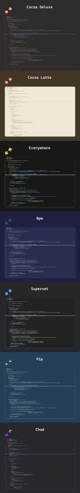

<p>&nbsp;</p>

## Description

A set of themes inspired on programming languages.

<p>&nbsp;</p>

## Installing
### Themes
1. Clone this repo:
```sh
git clone https://github.com/vlari/xcode-codebase-theme.git
```

2. Paste the theme to this location:
```sh
~/Library/Developer/Xcode/UserData/FontAndColorThemes
```

> If "UserData" and/or "FontAndColorThemes" folders don't exist, you can create them manually 

<p>&nbsp;</p>

### Font
The official font for this set of themes is Cascadia Code, you can download it from [here](https://github.com/microsoft/cascadia-code) and follow the installation instructions.

<p>&nbsp;</p>

## Themes



<p>&nbsp;</p>
